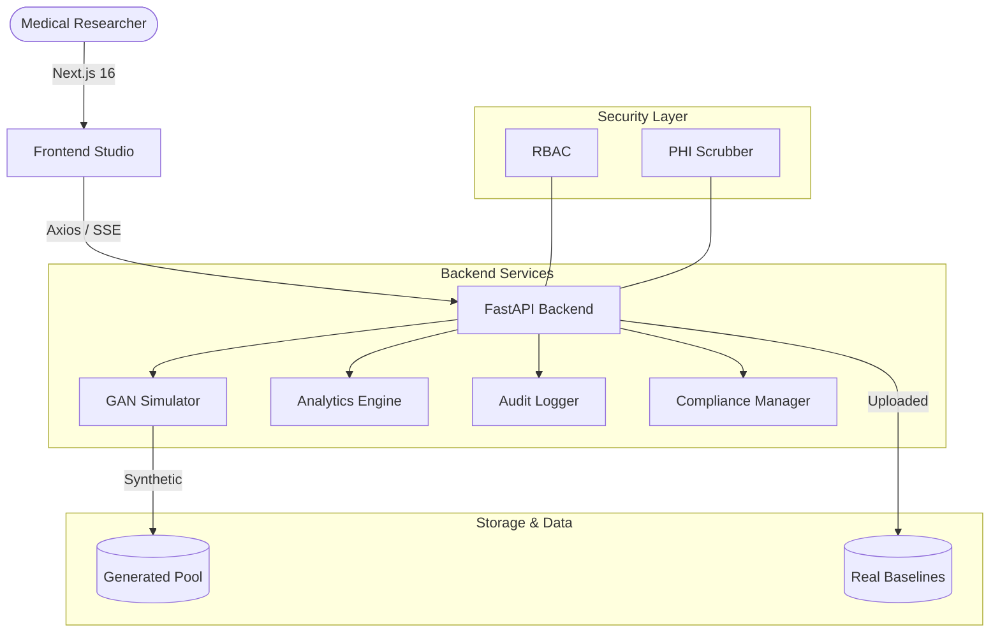

# MedSynth: Institutional-Grade Medical Data Synthesis

    

**MedSynth** is an advanced, privacy-first synthetic data studio designed to solve the critical shortage of high-fidelity training data in medical AI research. By leveraging Generative Adversarial Networks (GANs), MedSynth enables researchers to generate massive, clinically accurate cohorts without the regulatory risks and legal bottlenecks associated with Protected Health Information (PHI).

---

## 🏥 The Medical AI Crisis: No Data, No Innovation

### 🔒 The Problem: Healthcare's Data Deadlock

#### 1. The Data Fortress Problem
Hospitals have millions of medical records, but AI researchers get zero access. Every patient scan, lab result, and diagnosis is locked behind:

- **HIPAA/GDPR regulations** - Privacy laws that prevent data sharing
- **Hospital firewalls** - Security policies blocking external access
- **Legal complexity** - 12-18 months of paperwork for basic access
- **Ethical committees** - Months of approval processes

#### 2. The Bias Time Bomb
The tiny public datasets available (like Kaggle) are dangerously biased:

```
REALITY: 50% women, 30% elderly, 20% minorities
PUBLIC DATA: 30% women, 70% elderly, 5% minorities
```

**Result**: AI models trained on this biased data:
- Miss diseases in young patients
- Over-diagnose elderly patients
- Fail completely for minority groups
- Perpetuate healthcare disparities

#### 3. The Innovation Tax
Getting medical data has become a rich-country privilege:

| What's Needed | Reality for Most Researchers |
|---------------|------------------------------|
| **Time** | 12-18 months waiting |
| **Money** | $50K-$500K legal costs |
| **Resources** | Hospital partnerships |
| **Result** | Tiny, biased dataset |

**Impact**: 90% of medical AI projects fail before they start due to data access issues.

#### 4. The Human Cost
While researchers navigate paperwork:
- **300 people go blind daily** from preventable diabetic retinopathy
- Early cancer signs are missed due to inadequate screening tools
- Rare diseases remain undiagnosed due to lack of training data
- Healthcare disparities widen as AI learns from biased data

## 🚀 The Solution: MedSynth Pipeline
MedSynth bridges the gap between clinical privacy and AI research needs. It provides an end-to-end environment for uploading real baseline data, training GAN simulators, and generating "shadow" datasets that retain the clinical utility of the original while containing zero patient secrets.

### 🧪 How to Test the Project

#### 1. Simulated Mode (Default)
Run `python3 -m backend.main`. The dashboard will show simulated training curves and high-quality placeholder images.

#### 2. Real Hybrid Mode (The "Colab" Flow)
To test the real AI integration without damaging your device:
1.  **Prep Data**: Upload medical images in the **Upload** page.
2.  **Export**: Run `python scripts/export_dataset.py`. This creates a `dataset.zip` in the `generated/` folder.
3.  **Train in Cloud**: Upload that ZIP to **Google Drive** and run our [Colab Notebook](https://colab.research.google.com/).
4.  **Local Deployment**: 
    - Create a folder: `backend/weights/`.
    - Download your trained file as `generator_v1.pth` and place it there.
    - Restart the backend. You will see: `✅ Real GAN weights loaded`.

#### 3. Verification
- **Backend Tests**: Run `python3 -m pytest backend/tests`.
- **Benchmark**: Run `python3 scripts/benchmark_gan.py`.

### Key Pillars
- **Fidelity**: Statistical alignment with real-world clinical distributions.
- **Privacy**: Automated PHI scrubbing and structural anonymity.
- **Ethics**: Integrated bias detection and parity analysis for diverse cohorts.
- **Performance**: Institutional-grade reliability with offline support and hardware optimization.

---

## ✨ Core Features

### 1. Advanced GAN Simulation
- **Neural Synthesis**: Simulates complex medical imaging and structured metadata.
- **Epoch-Adaptive Training**: Real-time monitoring of loss, accuracy, and FID scores.
- **Low-Resource Mode**: Specifically optimized to run on **MacBook Pro M3 (8GB RAM)** without host system degradation.

### 2. Clinical-Grade Security & Governance
- **RBAC (Role-Based Access Control)**: Distinct workflows for Researchers, Admins, and Auditors.
- **Audit Logging**: Comprehensive, thread-safe logging of every data operation for regulatory compliance.
- **Privacy Impact Assessments (PIA)**: Integrated risk scoring and assessment workflows.

### 3. Quality & Bias Analytics
- **Demographic Parity**: Visualizes distribution alignment across age, gender, and ethnicity.
- **Fidelity Heatmaps**: Comparative pathology prevalence analysis.
- **Privacy Gauge**: Real-time re-identification risk scoring.

### 4. Institutional Resilience
- **PWA / Offline Support**: Service Worker integration for intermittent hospital Wi-Fi.
- **Error Recovery**: Global Error Boundaries preventing app-wide crashes.
- **Performance**: Backend GZip compression and API response caching.

---

## 🛠 Technical Architecture



---

## 🚀 Getting Started

### Prerequisites
- **Python 3.10+**
- **Node.js 18+**
- **Docker** (Recommended for production)

### Quick Start (Local Development)

1. **Clone & Setup Backend**
```bash
cd backend
python3 -m venv venv
source venv/bin/activate
pip install -r requirements.txt
python3 -m backend.main
```

2. **Setup Frontend**
```bash
cd frontend
npm install
npm run dev
```

3. **Login Credentials** (Default Dev Accounts)
- **Researcher**: `alice` / `password123`
- **Admin**: `admin` / `admin123`
- **Auditor**: `auditor` / `auditor123`

---

## 💻 Hardware Optimization (Apple Silicon)
MedSynth is highly optimized for the **M3 MacBook Pro (8GB RAM)**:
- **Automatic Resource Detection**: Backend halves epoch cycles and batch sizes when `LOW_RESOURCE_MODE=true`.
- **Docker Limits**: Pre-configured `docker-compose.yml` caps backend memory at 4GB to preserve host stability.

---

## ☁️ Hybrid AI Flow
MedSynth uses a **Hybrid Cloud-Local** architecture:
1. **Local (Mac)**: Data management, scrubbing, and lightweight inference.
2. **Cloud (Google Colab)**: Compute-intensive GAN training using free NVIDIA T4 GPUs.
3. **Storage (Google Drive)**: Persistent checkpointing for multi-day training runs.

---


